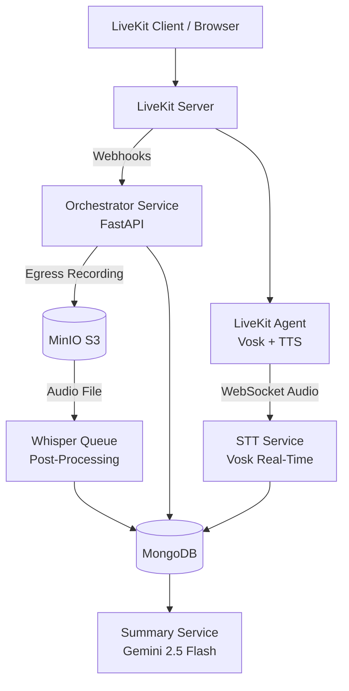
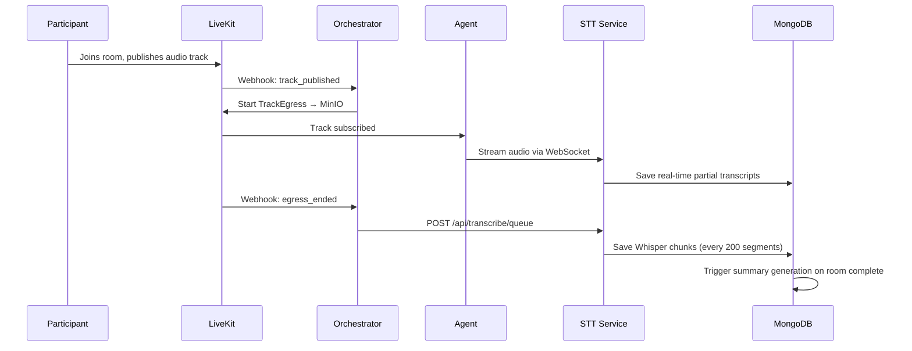
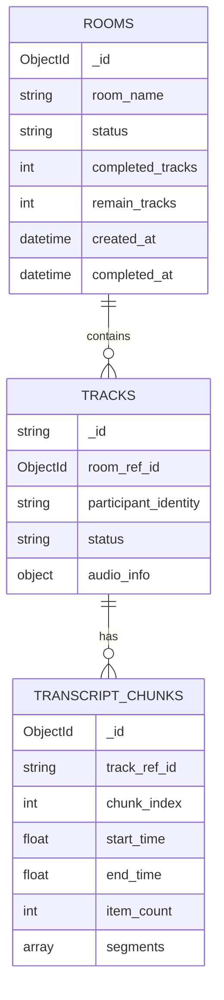

# Architect MultiClient Server — Real-Time Voice AI Platform

A scalable, microservice-based backend platform that processes real-time audio streams from LiveKit rooms, transcribes speech using Vosk and Whisper, synthesizes spoken responses with Kokoro TTS, and automatically generates AI-powered conversation summaries using Google Gemini.

---

## 🎯 Project Overview

This system was designed to handle **multi-participant voice rooms** — where each participant's audio track is captured, recorded, transcribed, and analyzed independently, all in real time. The architecture solves a deceptively hard problem: how do you run per-client, low-latency speech recognition for dozens of concurrent users without shared state causing cross-talk or bottlenecks?

**My role:** Designed and implemented the entire backend system — from the LiveKit agent entrypoint and per-client pipeline architecture, to the orchestrator service, transcription queue, and Whisper post-processing pipeline.

---

## 💡 Background & Motivation

Most speech-to-text systems are built for a single speaker or a batch-processing model. Real-world meeting and interview platforms require:

- **Per-speaker transcription** with accurate attribution
- **Low latency** — users need feedback in under 500ms
- **Reliability** — a single client's failure must not affect others
- **Post-processing** — clean transcripts for storage and AI summarization

This project emerged from the need to build exactly that: a platform where every audio track in a LiveKit room is independently recorded, streamed to a dedicated STT pipeline, stored in MongoDB in structured chunks, and ultimately summarized by a large language model.

---

## 🛠️ Technology Stack & Architecture

### Core Services

The platform is split into three independent microservices:

**Orchestrator Service** (`orchestrator_service/`) — The central brain. Built with FastAPI, it handles LiveKit webhook events, manages room lifecycle, dispatches agents, controls egress recordings, and exposes REST APIs for rooms, tracks, and transcripts.

**STT Service** (`stt_service/`) — The real-time speech engine. Accepts WebSocket audio streams from LiveKit agents, runs Vosk for streaming recognition, and queues completed recordings for Whisper post-processing.

**TTS Service** (`tts_service/`) — Text-to-speech synthesis using the Kokoro-82M neural TTS model, invoked via LiveKit DataChannel messages.

### Technology Choices

| Category | Technology | Notes |
|----------|------------|-------|
| Backend Framework | FastAPI | Async, high-performance REST + WebSocket |
| Real-Time Transport | LiveKit | WebRTC-based audio/video rooms |
| Streaming STT | Vosk | Per-client KaldiRecognizer, offline, low-latency |
| Batch STT | faster-whisper | Post-processing for higher accuracy |
| TTS | Kokoro-82M | Neural TTS via KPipeline |
| Database | MongoDB | Motor async driver + structured chunked storage |
| Object Storage | MinIO | S3-compatible audio file recordings |
| AI Summarization | Google Gemini 2.5 Flash | Meeting summary + action item extraction |
| Agent Runtime | LiveKit Agents SDK | Agent lifecycle and room management |

### System Architecture



### Request Flow: Audio → Transcript



---

## ✨ Key Features

### Per-Client Inference Pipeline Architecture

The most technically significant design decision: every connected client gets their own **dedicated Vosk `KaldiRecognizer` instance** running in a dedicated thread — completely isolated from all other clients.

```python
class ClientInferencePipeline:
    def __init__(self, client_id, session_id, model, ...):
        self.recognizer = KaldiRecognizer(model, sample_rate)
        self.audio_queue = queue.Queue(maxsize=500)
        self._processing_thread = threading.Thread(
            target=self._processing_loop, daemon=True
        )
```

This eliminates shared-state concurrency bugs, allows per-client adaptive chunk sizing based on load, and makes failure isolation trivial — one client's error never affects another's pipeline.

### Adaptive Chunk Processing

Chunk batch size adjusts dynamically based on how many clients are active:

```python
def _get_adaptive_chunk_size(self):
    if concurrent_clients <= 2:   return 4   # Low latency
    elif concurrent_clients <= 4: return 2   # Balanced
    else:                         return 1   # Optimal sweet spot
```

### Circuit Breaker Pattern

Each pipeline includes a circuit breaker that automatically disconnects a client if their pipeline records too many consecutive failures — preventing a broken client from consuming resources indefinitely.

### Structured Transcript Storage

Transcripts are stored in MongoDB in a three-tier hierarchy — **Rooms → Tracks → Chunks** — where each chunk holds up to 200 segments. This enables efficient pagination, time-range queries, and confidence filtering without loading entire transcripts into memory.



### LiveKit Webhook-Driven Lifecycle

The orchestrator is entirely event-driven. LiveKit sends webhooks for track publish/unpublish, egress start/end events. The system registers rooms explicitly (via an internal agent call) and filters all webhooks against the registry — preventing phantom processing of rooms that aren't supposed to be active.

### AI-Powered Meeting Summarization

When all tracks for a room are processed, the system automatically:

1. Retrieves all transcript segments and sorts them by absolute timestamp
2. Reconstructs a speaker-attributed conversation timeline
3. Calls Google Gemini with a structured JSON schema prompt
4. Saves both a human-readable summary and per-participant action items

```python
class SummaryActionItemsResult(BaseModel):
    summary: str
    action_items: List[ActionItemResult]

class ActionItemResult(BaseModel):
    participant_identity: str
    participant_actions: List[str]
```

### TTS via DataChannel

Text-to-speech is triggered by sending a JSON message to the LiveKit room's `tts_control` DataChannel topic. The agent's TTS manager receives it, synthesizes audio with Kokoro, and publishes the audio track back to the room — no separate WebSocket connection required.

---

## 📊 Results & Impact

The architecture was validated under multi-client concurrent load:

| Metric | Result |
|--------|--------|
| Concurrent clients per agent | Up to 30 (configurable) |
| Real-time STT latency (Vosk) | < 500ms per chunk |
| Whisper post-processing accuracy | Significantly higher than Vosk alone |
| Transcript chunk size | 200 segments per chunk (configurable) |
| Summary generation | Fully automated on room close |
| Fault isolation | Per-client circuit breaker, zero cross-contamination |

---

## 🚧 Challenges & Solutions

### Challenge 1: Shared Vosk Recognizer Causes Cross-Talk

**Problem:** Initial implementation used a shared `KaldiRecognizer` instance across all clients via a worker pool. When two clients spoke simultaneously, Vosk would mix their audio context, producing garbled results.

**Solution:** Moved to per-client dedicated pipelines — each client gets their own `KaldiRecognizer`, its own audio queue, and its own processing thread. The `PipelineManager` manages lifecycle, limits, and idle cleanup.

**Result:** Zero cross-client contamination; each transcript is attributed correctly.

---

### Challenge 2: Egress Recordings Starting After Room Registration

**Problem:** The agent connects to a room before the orchestrator's `/register` endpoint is called. This means the `track_published` webhook fires before the room is in the registry, causing recordings to be skipped.

**Solution:** The `/register` endpoint performs a retroactive sweep — it lists current participants via the LiveKit API and starts egress for any audio tracks already published before registration.

```python
for participant in participants_response.participants:
    for track in participant.tracks:
        if is_audio(track):
            asyncio.create_task(egress_service.start_recording(...))
```

**Result:** No missed recordings, even when agents connect before orchestrator registration completes.

---

### Challenge 3: Room Completion Race Condition

**Problem:** The room should be marked `completed` only when both (a) all tracks are transcribed AND (b) the room has been explicitly finalized. These two events arrive asynchronously.

**Solution:** A `check_and_complete_room()` method is called from two places — when a track status changes AND when the room is finalized. It atomically checks: `status == "final_room"` AND `pending tracks == 0`. Only then does it trigger completion and summary generation.

**Result:** No premature completions; summaries are always generated on a complete dataset.

---

### Challenge 4: Thread-to-Asyncio Result Dispatch

**Problem:** Vosk runs inside a dedicated thread per client. Sending results to a WebSocket requires running asyncio coroutines — which can't be called directly from threads.

**Solution:** The `ClientInferencePipeline` captures a reference to the main event loop at initialization time. Results are dispatched via `asyncio.run_coroutine_threadsafe(coro, self._main_loop)`, which is thread-safe and non-blocking from the calling thread.

The `OptimizedResultDispatcher` gives each client their own `asyncio.Queue` and a dedicated dispatcher coroutine — so slow WebSocket sends for one client never block another's results.

---

## 💪 Lessons Learned

**Per-client isolation is worth the complexity.** A shared worker pool seems simpler until you hit the first concurrency bug. Dedicated pipelines are harder to build but far easier to reason about under load.

**Event-driven webhook architecture scales cleanly.** By filtering all processing through a room registry and reacting to LiveKit events, the orchestrator stays stateless in a good way — it can be restarted without losing in-flight state (which lives in MongoDB and MinIO).

**Structured storage pays off at query time.** Storing transcripts as chunks (rather than flat arrays) enabled pagination, time-range filtering, and confidence queries without aggregation pipelines on millions of documents.

**Circuit breakers belong at the pipeline level, not the service level.** A service-level circuit breaker would have protected the service but left problematic clients connected. Per-client circuit breakers clean up the right resource at the right granularity.

---

## 🚀 Future Roadmap

**Near-term:**
🌍 **Multi-language Model Selection per Client**
  Dynamically select Vosk STT models per client session (language is provided during WebSocket handshake), enabling scalable multi-tenant real-time transcription.

📊 **Prometheus Metrics & Observability Layer**
  Integrate Prometheus-based monitoring (infrastructure ready), finalize dashboards for latency, throughput, STT accuracy metrics, and system resource usage.

🔐 **JWT-based Authentication for Transcript API**
  Implement production-grade JWT authentication and authorization layer (authentication placeholder already exists in `transcript_auth.py`), including token validation, expiration handling, and role-based access control.

🔄 **Migration to Message-Driven Architecture (Redis / Message Queue)**
  Refactor inter-service communication to use Redis Pub/Sub or message queue patterns instead of direct in-memory calls.
  Goals:

  * Decouple STT workers from WebSocket layer
  * Improve horizontal scalability
  * Enable distributed processing across multiple nodes
  * Increase fault tolerance and replay capability
  * Prepare orchestrator layer for LiveKit + Mezon bots integration


**Longer-term:**
🤖 Real-time LLM responses via the TTS pipeline (question detection → Gemini → Kokoro → speaker)
📱 SDK client libraries for iOS/Android WebRTC integration
🔄 Horizontal scaling of the STT service with consistent hashing for client-to-instance routing

