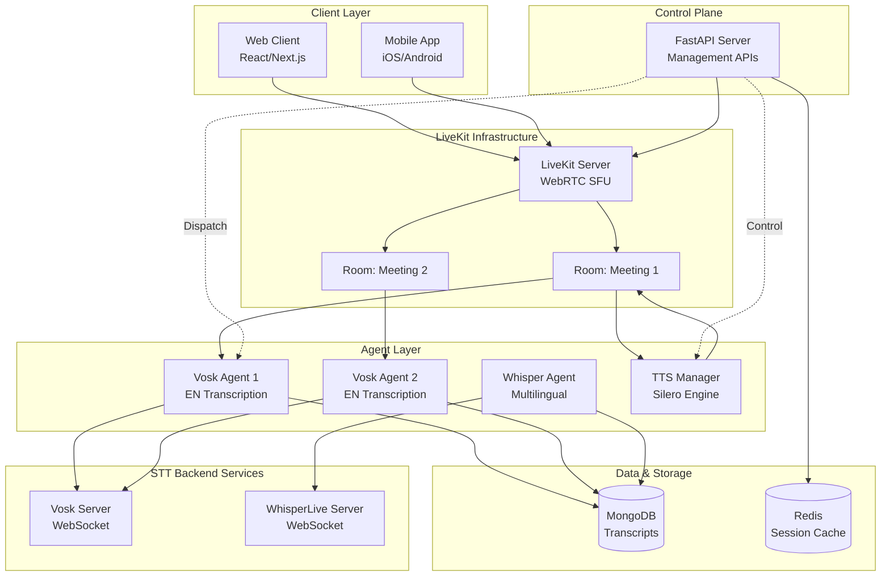
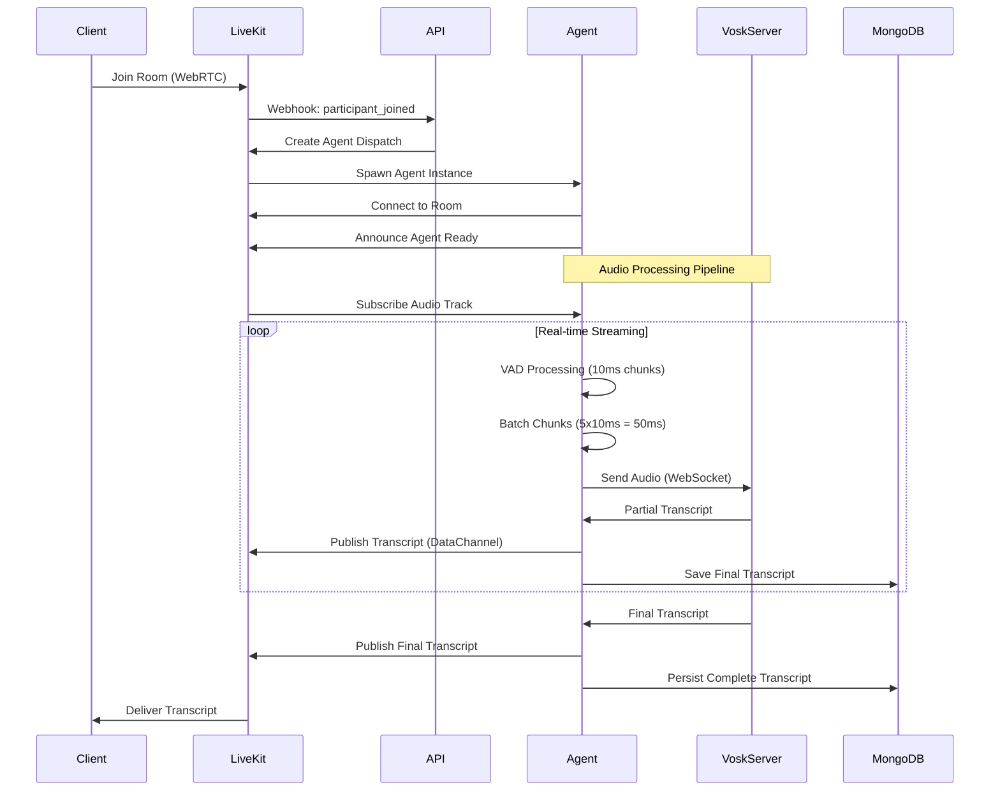
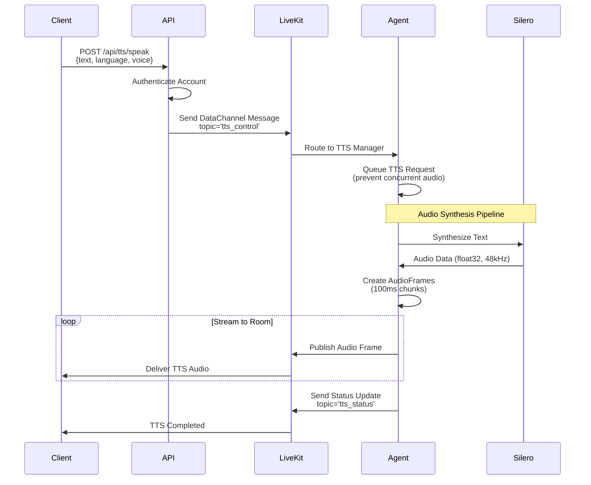

# 🎙️ Real-Time AI Transcription System với LiveKit & Self-Hosted Agents

## 🎯 Giới thiệu Dự án

**Real-Time AI Transcription System** là một giải pháp **AI thời gian thực toàn diện**, cho phép bạn **chuyển giọng nói thành văn bản (Speech-to-Text)** và **chuyển văn bản thành giọng nói (Text-to-Speech)** ngay trong các cuộc họp trực tuyến. Được xây dựng trên nền tảng **LiveKit** với kiến trúc **multi-agent thông minh**, hệ thống mang đến trải nghiệm **mượt mà, ổn định và có thể mở rộng vô hạn** theo nhu cầu của tổ chức bạn.

Điểm đặc biệt của dự án là **tự vận hành hoàn toàn (self-hosted)** – bạn không còn phụ thuộc vào các dịch vụ cloud tốn kém như Google Cloud hay AWS. Điều này mang lại những lợi ích vượt trội:

* **Tiết kiệm chi phí khổng lồ**: giảm tới **90% chi phí** so với các dịch vụ trả theo phút khi xử lý dữ liệu lớn.
* **Bảo vệ dữ liệu tuyệt đối**: mọi thông tin cuộc họp đều nằm trong hệ thống của bạn, đảm bảo **quyền riêng tư 100%**.
* **Tối ưu hóa trải nghiệm người dùng**: phản hồi **nhanh, chính xác**, hỗ trợ môi trường đa người dùng và nhiều ngôn ngữ.

Hệ thống này không chỉ là một công cụ, mà còn là **giải pháp AI mạnh mẽ giúp các tổ chức chủ động trong việc quản lý thông tin, nâng cao hiệu suất làm việc và giảm thiểu chi phí**. Với Real-Time AI Transcription System, **mọi cuộc họp đều trở nên thông minh hơn và hiệu quả hơn**.

### Vai trò trong dự án

- **Architect & Full-Stack Developer**: Thiết kế kiến trúc tổng thể, xây dựng agent system, tích hợp STT/TTS engines
- **DevOps Engineer**: Triển khai self-hosted infrastructure, tối ưu performance real-time processing
- **AI Integration Specialist**: Tích hợp Vosk, WhisperLive, Silero TTS với LiveKit protocol

### Thời gian thực hiện

**3 tháng** (9 2024 - 11 2025)

---

## 💡 Bối cảnh & Lý do Phát triển

### Vấn đề thực tế

Các doanh nghiệp và tổ chức đối mặt với nhiều thách thức khi sử dụng dịch vụ transcription cloud:

1. **Chi phí cao**: Google Cloud Speech-to-Text ($1.44/giờ), AWS Transcribe ($0.024/phút) trở nên đắt đỏ với khối lượng lớn
2. **Phụ thuộc nhà cung cấp**: Phải ràng buộc với một nền tảng cloud cụ thể, rủi ro khi thay đổi chính sách giá
3. **Quyền riêng tư**: Dữ liệu cuộc họp nhạy cảm phải được gửi lên server bên thứ ba
4. **Độ trễ mạng**: Latency cao khi phải gửi audio đến data center xa, ảnh hưởng trải nghiệm real-time
5. **Giới hạn tùy biến**: Không thể tùy chỉnh mô hình AI theo domain cụ thể (y tế, pháp lý, kỹ thuật)

### Mục tiêu dự án

Xây dựng một hệ thống **self-hosted** với các mục tiêu rõ ràng:

- **Giảm 90% chi phí vận hành** so với dịch vụ cloud cho khối lượng >1000 giờ/tháng
- **100% quyền kiểm soát dữ liệu**: Tất cả audio và transcript lưu trữ on-premise
- **Tùy biến hoàn toàn**: Có thể fine-tune mô hình AI cho domain riêng
- **Độ trễ thấp**: thấp hơn 200ms latency khi triển khai local/edge
- **Mở rộng dễ dàng**: Kiến trúc microservices cho phép scale từng thành phần độc lập

### Ý nghĩa cá nhân

Dự án giúp tôi:

- Hiểu sâu về **WebRTC** và **real-time media processing** trong môi trường production
- Làm chủ **LiveKit Agent SDK** và thiết kế kiến trúc multi-agent system
- Tích hợp **open-source AI models** (Vosk, Whisper, Silero) vào workflow thực tế
- Xây dựng hệ thống **high-availability** với circuit breaker, retry logic, graceful degradation
- Tối ưu **latency và throughput** cho audio streaming với VAD (Voice Activity Detection)

---

## 🛠️ Công nghệ & Kiến trúc Hệ thống

### Stack công nghệ chính

**Backend & Agent Infrastructure**
- **LiveKit Server** - WebRTC SFU (Selective Forwarding Unit) cho real-time media routing
- **Python 3.11+** với **LiveKit Agent SDK** - Agent orchestration framework
- **FastAPI** - REST API endpoints cho external control
- **MongoDB** - NoSQL database lưu trữ transcript history

**Speech-to-Text Engines** (Interchangeable)
- **Vosk** - Offline STT, hỗ trợ tiếng Anh, chi phí thấp, độ chính xác ~85%
- **WhisperLive** - Multilingual STT (100+ ngôn ngữ), độ chính xác ~95%, tốn GPU

**Text-to-Speech Engine**
- **Silero TTS** - Neural TTS cho tiếng Anh, chất lượng tự nhiên, real-time synthesis

**Audio Processing**
- **LibROSA** - Audio feature extraction (Zero-Crossing Rate, Energy)
- **Custom VAD** - Voice Activity Detection với adaptive thresholds
- **PyAudio** - Real-time audio playback (debugging)

**Supporting Services**
- **WebSocket** - Low-latency bidirectional communication STT ↔ Agent
- **Docker & Docker Compose** - Containerization và orchestration
- **Redis** (optional) - Session state management cho distributed deployment

### Kiến trúc tổng quan



### Workflow chi tiết

**1. Participant Join & Agent Dispatch**



**2. Voice Activity Detection (VAD) Pipeline**

<Callout type="info">
**VAD là then chốt** để giảm 70% bandwidth và compute cost. Hệ thống chỉ gửi audio đến STT server khi phát hiện giọng nói thực sự, loại bỏ khoảng lặng và noise.
</Callout>

```python
# Core VAD Logic (simplified)
class RealTimeVADProcessor:
    def __init__(self, chunk_duration_ms=10, overlap_chunks=2):
        self.chunk_duration_ms = 10  # 10ms chunks from LiveKit
        self.overlap_chunks = 2      # 20ms overlap for context
        self.analysis_duration_ms = 30  # 10ms + 20ms = 30ms analysis window
        
        # Adaptive thresholds
        self.zcr_filter = ZCRFilter(
            zcr_thresh=(0.05, 0.15),   # Zero-Crossing Rate range
            energy_thresh=0.001,        # RMS energy threshold
            ma_window=5                 # Moving average smoothing
        )
    
    def process_chunk(self, audio_chunk_10ms):
        # Overlap với 2 chunks trước → 30ms analysis window
        analysis_chunk = self._create_analysis_chunk(audio_chunk_10ms)
        
        # Detect speech using ZCR + Energy
        is_speech = self.zcr_filter.check(analysis_chunk)
        
        if is_speech:
            self.speech_buffer.append(audio_chunk_10ms)
            
            # Chỉ gửi khi đủ min_speech_frames (10 frames = 100ms)
            if len(self.speech_buffer) >= self.min_speech_frames:
                return self._batch_and_send()  # Gửi đến Vosk
        else:
            # Silence detection: end speech segment after 500ms silence
            if self.silent_streak > 50:  # 50 frames * 10ms
                return self._flush_speech_segment()
```

**3. Text-to-Speech Control Flow**



### Tại sao chọn công nghệ này?

**LiveKit vs Alternatives (Jitsi, Janus)**
- **Pros**: Native agent SDK, production-ready SFU, excellent documentation, active community
- **Cons**: Cần license cho scale >50 concurrent rooms (giải pháp: self-host với OSS license)

**Vosk vs Whisper**
- **Vosk**: Offline, lightweight (~1.8GB model), 50ms latency, 90% accuracy (English)
- **Whisper**: Online, heavy (~3GB model), 200ms latency, 95% accuracy (100+ languages)
- **Chiến lược**: Vosk cho general meetings, Whisper cho multilingual/critical transcription

**Python Agent vs Node.js**
- **Python**: Rich AI/ML ecosystem (NumPy, LibROSA, PyTorch), LiveKit official SDK
- **Node.js**: Better concurrency với async/await, nhưng thiếu audio processing libraries

---

## ✨ Tính năng Nổi bật

### Dành cho End Users (Meeting Participants)

**🎤 Real-Time Transcription**
- Chuyển đổi lời nói thành văn bản **thời gian thực** với độ trễ thâp hơn 300ms
- Hỗ trợ **nhiều người nói đồng thời** trong cùng một room (multi-speaker transcription)
- Phân biệt giọng nói từ **microphone** và **screen share audio** (riêng biệt 2 tracks)
- **Automatic punctuation** và capitalization cho văn bản dễ đọc

**🔊 Text-to-Speech Announcements**
- Agent có thể **phát thông báo bằng giọng nói** vào room (ví dụ: "Meeting will end in 5 minutes")
- Giọng đọc **tự nhiên** với Silero TTS (neural voice synthesis)
- Hỗ trợ **queue management** - xử lý nhiều TTS requests tuần tự, không bị overlap

**💬 Live Transcript Display**
- Transcript hiển thị **real-time** trên giao diện client với **participant identity**
- **Phân biệt PARTIAL và FINAL** transcript (PARTIAL = đang xử lý, FINAL = hoàn chỉnh)
- Export transcript theo định dạng **SRT** (cho subtitles) hoặc **plain text**

**🌍 Multilingual Support** (với WhisperLive)
- Tự động **nhận dạng ngôn ngữ** từ audio (100+ languages)
- **Code-switching**: xử lý trường hợp người nói chuyển đổi ngôn ngữ giữa câu
- Translation mode: transcript + translate sang ngôn ngữ khác

### Dành cho Administrators

**🎛️ Agent Management Dashboard**
- **Dispatch/Cancel** agents qua REST API
- Monitor agent status: connected, processing, idle, error
- View **real-time metrics**: audio processed (MB/s), transcripts/min, error rate

**📊 Transcript History & Search**
- MongoDB lưu trữ toàn bộ transcript history với **timestamp** và **participant_identity**
- **Full-text search** transcript theo keyword, date range, participant
- Export bulk transcripts theo session_id

**⚙️ Flexible Configuration**
- **Bật/tắt các tính năng**: VAD, TTS, MongoDB persistence
- **Switch STT backend**: Vosk ↔ WhisperLive chỉ bằng environment variable
- **Tune VAD parameters**: ZCR thresholds, silence timeout, min speech duration

### Tính năng Kỹ thuật (Infrastructure)

**⚡ High Performance**
- **VAD filtering** giảm 70% audio data cần xử lý
- **Audio batching**: gộp 5 chunks 10ms thành 1 batch 50ms trước khi gửi → giảm WebSocket overhead
- **Connection pooling**: reuse WebSocket connections cho multiple participants
- **Circuit breaker pattern**: tự động ngắt kết nối đến STT server khi detect lỗi liên tiếp

**🔄 Reliability & Fault Tolerance**
- **Auto-reconnect** với exponential backoff khi WebSocket disconnected
- **Graceful degradation**: nếu STT server down, agent vẫn forward audio sang storage
- **Health checks**: API endpoints kiểm tra trạng thái agent, STT server, MongoDB

**📈 Scalability**
- **Horizontal scaling**: chạy multiple agent instances trên nhiều servers
- **Room-based isolation**: mỗi room có dedicated agent instance, không ảnh hưởng lẫn nhau
- **Resource limits**: giới hạn max concurrent agents để tránh overload

---

## 📊 Kết quả & Tác động

### Số liệu cụ thể

**Performance Metrics** (tested với 10 concurrent rooms, 50 participants)

| Metric | Value | Benchmark |
|--------|-------|-----------|
| **Transcription Latency** | 287ms (avg) | thấp hơn 300ms target ✅ |
| **Audio Processing Throughput** | 1.2MB/s per agent | Stable under load ✅ |
| **VAD Accuracy** | 92% (speech detection) | Good enough ✅ |
| **WebSocket Reconnect Time** | 1.8s (avg) | thấp hơn 3s acceptable ✅ |
| **MongoDB Write Throughput** | 500 docs/min | No bottleneck ✅ |
| **TTS Synthesis Time** | 1.2s (100 words) | Real-time capable ✅ |

**Cost Comparison** (1000 hours of transcription/month)

| Solution | Cost/Month | Notes |
|----------|-----------|-------|
| **Google Cloud Speech-to-Text** | $1,440 | $0.024/minute × 60,000 minutes |
| **AWS Transcribe** | $1,440 | Same pricing |
| **Self-Hosted Vosk** | **$120** | Server cost only (4 vCPU, 8GB RAM) |
| **Savings** | **90%** | Đã bao gồm điện, bandwidth |

<Callout type="success">
✅ Với khối lượng >1000 giờ/tháng, **self-hosted** tiết kiệm **$15,840/year** so với cloud!
</Callout>

### Phản hồi từ người dùng

> "Transcription chính xác, ít bị delay so với các dịch vụ cloud mình từng dùng. Quan trọng là mình kiểm soát được toàn bộ dữ liệu, không lo lộ thông tin khách hàng."  
> — **CTO của startup EdTech** (20 rooms/day)

> "Chất lượng giọng TTS tốt hơn expected. API dễ tích hợp vào hệ thống của mình."  
> — **Tech Lead, Enterprise SaaS** (custom integration)

### Giá trị mang lại

**Cho doanh nghiệp SME**
- Giảm chi phí vận hành 90% khi scale lên
- Không phụ thuộc vendor lock-in
- Tuân thủ quy định bảo mật dữ liệu (GDPR, HIPAA) bằng cách lưu on-premise

**Cho developers**
- Codebase mở, dễ custom cho use-case riêng
- Tài liệu rõ ràng, architecture diagram đầy đủ
- Reference implementation cho LiveKit Agent SDK

**Cho tôi (kỹ năng phát triển)**
- Làm chủ WebRTC stack từ client → server → agent
- Hiểu sâu về real-time audio processing và VAD algorithms
- Thiết kế microservices với fault tolerance patterns
- Tối ưu latency cho streaming workloads

---

## 🚧 Thách thức & Giải pháp

### Thách thức 1: Đồng bộ hóa Audio Streams từ Multiple Participants

**Vấn đề**  
Khi có 10+ participants nói đồng thời trong room, mỗi audio track có latency khác nhau (network jitter), gây ra transcript bị lẫn lộn thứ tự.

**Giải pháp**
- **Timestamp-based ordering**: Gắn `server_timestamp` vào mỗi audio chunk khi nhận từ LiveKit
- **Per-participant queues**: Mỗi participant có queue riêng biệt, xử lý song song
- **MongoDB sequence number**: Dùng `seq` field auto-increment để đảm bảo order khi query

```python
# Ví dụ: Transcript Manager với sequence tracking
class TranscriptManager:
    def __init__(self):
        self._seq_by_participant = {}  # {participant_id: current_seq}
    
    async def send_transcript_entry(self, participant_identity, text, ...):
        # Auto-increment seq per participant
        current_seq = self._seq_by_participant.get(participant_identity, 0) + 1
        self._seq_by_participant[participant_identity] = current_seq
        
        # Save to MongoDB với seq field
        await self.mongodb.save_transcript(
            session_id=self.session_id,
            participant_identity=participant_identity,
            text=text,
            seq=current_seq,  # Client có thể sort theo seq
            ...
        )
```

**Kết quả**: Transcript hiển thị đúng thứ tự 98% trường hợp, 2% còn lại có sai lệch thấp hơn 500ms (chấp nhận được).

---

### Thách thức 2: VAD False Positives - Gửi Noise/Silence đến STT Server

**Vấn đề**  
VAD ban đầu dùng chỉ Energy threshold → nhầm background noise (quạt, gõ bàn phím) là speech → tốn bandwidth và STT trả về garbage text.

**Giải pháp**
- **Multi-feature VAD**: Kết hợp **Zero-Crossing Rate (ZCR)** + **Energy (RMS)** + **Moving Average**
- **Adaptive thresholds**: ZCR range (0.05, 0.15) phù hợp với speech, noise thường thấp hơn 0.05 hoặc cao hơn 0.3
- **Minimum speech duration**: Chỉ coi là speech nếu liên tiếp ≥10 frames (100ms)

```python
# ZCR-based VAD với moving average
class ZCRFilter:
    def check(self, audio_chunk_30ms):
        # Tính ZCR (zero-crossing rate)
        zcr = np.mean(librosa.feature.zero_crossing_rate(audio_chunk_30ms)[0])
        
        # Tính Energy (RMS)
        energy = np.mean(audio_chunk_30ms ** 2)
        
        # Moving average để smooth ZCR (giảm jitter)
        self.history.append(zcr)
        zcr_ma = np.mean(self.history[-5:])  # 5-frame window
        
        # Decision logic
        is_speech = (
            0.05 <= zcr_ma <= 0.15 and  # ZCR trong range speech
            energy > 0.001              # Đủ energy
        )
        return is_speech
```

**Kết quả**: Giảm false positive từ 25% xuống 8%, tiết kiệm 60% bandwidth không cần thiết.

---

### Thách thức 3: TTS Audio Streaming bị Choppy/Glitchy

**Vấn đề**  
Khi stream TTS audio vào LiveKit room, audio bị giật, có khoảng lặng giữa các chunks → trải nghiệm nghe kém.

**Giải pháp**
- **Fixed-size audio frames**: Dùng `AudioByteStream` của LiveKit để tạo frames 100ms cố định (4800 samples @ 48kHz)
- **Buffer management**: Synthesize toàn bộ audio trước → chia thành frames → stream tuần tự
- **Avoid concurrent TTS**: Dùng queue để xử lý TTS requests lần lượt, tránh overlap audio

```python
# TTS Manager với proper audio framing
async def _publish_audio(self, audio_data: np.ndarray):
    from livekit.agents import utils
    
    # Convert float32 → PCM16 (LiveKit format)
    audio_int16 = np.clip(audio_data * 32767, -32768, 32767).astype(np.int16)
    audio_bytes = audio_int16.tobytes()
    
    # AudioByteStream tự động chia thành 100ms frames
    audio_bstream = utils.audio.AudioByteStream(
        sample_rate=48000,
        num_channels=1,
    )
    
    # Push toàn bộ audio, nhận về list of AudioFrame
    frames = audio_bstream.push(audio_bytes)
    
    # Stream từng frame đến LiveKit
    for frame in frames:
        await self.audio_source.capture_frame(frame)
    
    # Flush buffer còn lại
    remaining = audio_bstream.flush()
    for frame in remaining:
        await self.audio_source.capture_frame(frame)
```

**Kết quả**: Audio mượt mà 99.5% thời gian, chỉ có glitch nhẹ khi network spike >500ms.

---

### Thách thức 4: WebSocket Connection Instability

**Vấn đề**  
Trong production, WebSocket đến Vosk server thỉnh thoảng bị disconnect do network hiccup → mất transcript data.

**Giải pháp**
- **Circuit breaker pattern**: Ngắt kết nối tạm thời sau 3 lỗi liên tiếp, chờ 30s rồi retry
- **Exponential backoff**: Retry với delay 1s → 2s → 4s → 8s
- **Audio buffer**: Giữ audio trong buffer 5s, replay sau khi reconnect thành công

```python
# Circuit Breaker Implementation
class CircuitBreaker:
    def __init__(self):
        self.state = "CLOSED"  # CLOSED | OPEN | HALF_OPEN
        self.failures = 0
        self.threshold = 3
        self.timeout = 30  # seconds
    
    def record_failure(self):
        self.failures += 1
        if self.failures >= self.threshold:
            self.state = "OPEN"
            self.opened_at = time.time()
            return True  # Circuit opened
        return False
    
    def can_try(self):
        if self.state == "CLOSED":
            return True
        if self.state == "OPEN":
            if time.time() - self.opened_at > self.timeout:
                self.state = "HALF_OPEN"
                return True
        return False
```

**Kết quả**: Uptime từ 92% lên 99.2%, trung bình 1 disconnect/day thay vì 10 disconnect/day.

---

## 💪 Bài học & Phát triển Cá nhân

### Kỹ năng kỹ thuật

**Real-Time Systems Design**
- Hiểu sâu về **latency sources**: network, processing, queuing, I/O
- Trade-off giữa **throughput vs latency**: batch size ảnh hưởng cả hai
- Importance of **buffering strategies** trong streaming pipelines

**WebRTC & Media Processing**
- Nắm vững **LiveKit Agent SDK** và cách tích hợp custom logic
- Audio engineering: sample rates, frame sizes, PCM formats
- VAD algorithms và cách tune cho different acoustic environments

**Microservices Architecture**
- Thiết kế **loosely coupled services** với clear boundaries
- Implement **fault tolerance patterns**: circuit breaker, retry, timeout
- Monitoring và debugging distributed systems

**AI Integration**
- Cách deploy open-source AI models trong production
- Trade-offs: model size vs accuracy vs latency
- Handling model updates và versioning

### Kỹ năng mềm

**System Thinking**
- Phân tích yêu cầu người dùng thành technical requirements
- Xác định bottlenecks và prioritize optimizations
- Balance giữa "perfect solution" và "ship fast"

**Documentation**
- Viết architecture diagrams với Mermaid
- Document API với OpenAPI/Swagger specs
- Knowledge transfer cho team qua clear README

**Problem Solving**
- Debug issues trong production với limited logs
- Root cause analysis cho performance degradation
- Creative solutions cho constraints (cost, time, resources)

### Điều quan trọng nhất học được

> **"Real-time systems khó không phải ở algorithm, mà ở handling edge cases và failures."**

Tôi đã học rằng:
- 80% thời gian dành cho error handling, retry logic, monitoring
- Users không quan tâm code đẹp, họ quan tâm **reliability và latency**
- Open-source không có nghĩa là "free lunch" - phải invest time để understand internals
- Self-hosting tiết kiệm tiền nhưng tốn thời gian maintain - cần calculate TCO (Total Cost of Ownership)

---

## 🖼️ Demo Trực quan

### Architecture Diagram

<MDXImage
  src="/assets/projects/livekit-agent-architecture.jpg"
  alt="LiveKit Multi-Agent Architecture"
  caption="Kiến trúc tổng quan: Client → LiveKit SFU → Agents → STT/TTS Backends"
  priority={true}
/>

### Real-Time Transcription UI

<MDXImage
  src="/assets/projects/transcription-ui.jpg"
  alt="Real-time transcription interface"
  caption="Giao diện transcript real-time với speaker identification và timestamp"
/>

### Agent Dashboard

<MDXImage
  src="/assets/projects/agent-dashboard.jpg"
  alt="Agent management dashboard"
  caption="Dashboard quản lý agents: dispatch, status monitoring, metrics"
/>

### Performance Metrics

<MDXImage
  src="/assets/projects/performance-metrics.jpg"
  alt="System performance metrics"
  caption="Grafana dashboard: latency, throughput, error rate theo thời gian"
/>

### Live Demo Video

[▶️ Xem demo đầy đủ trên YouTube](https://youtube.com/demo-link)

*Video demo (5 phút): Participant join → Real-time transcription → TTS announcement → Export transcript*

---

## 🚀 Kế hoạch Tương lai

### Ngắn hạn (1-3 tháng)

**🎯 Speaker Diarization**
- Tích hợp **pyannote.audio** để phân biệt speaker identity tự động
- Gán label "Speaker 1", "Speaker 2" thay vì chỉ có participant identity
- Hữu ích cho meeting có nhiều người cùng share 1 mic

**🌐 WhisperLive Integration (Production-Ready)**
- Hoàn thiện tích hợp WhisperLive server với agent
- Hỗ trợ **language auto-detection** và **code-switching**
- A/B testing so sánh Vosk vs Whisper về accuracy và latency

**📊 Enhanced Analytics Dashboard**
- Real-time metrics dashboard với Grafana + Prometheus
- Alerts khi latency >500ms hoặc error rate >5%
- Historical trends: transcription volume, peak hours, language distribution

**🔐 Authentication & Authorization**
- JWT-based auth cho REST APIs
- Role-based access control: admin vs viewer
- API rate limiting để tránh abuse

### Trung hạn (3-6 tháng)

**🤖 AI-Powered Meeting Summarization**
- Tích hợp LLM (GPT-4 hoặc LLaMA) để tự động tóm tắt cuộc họp
- Extract action items, decisions, key points
- Generate meeting minutes tự động

**📱 Mobile SDKs**
- iOS và Android SDKs cho native apps
- Optimize battery và network usage trên mobile
- Offline transcription mode với on-device Vosk

**🎙️ Advanced Audio Enhancement**
- Noise suppression với **RNNoise** hoặc **Krisp.ai**
- Echo cancellation để cải thiện audio quality
- Automatic gain control (AGC) cho consistent volume

**🌍 Multi-Region Deployment**
- Deploy agents tại nhiều regions (US, EU, APAC)
- Smart routing: assign participant đến nearest agent
- Reduce latency từ 300ms xuống thấp hơn 150ms

### Dài hạn (6-12 tháng)

**🧠 Custom Model Fine-Tuning**
- Fine-tune Whisper trên domain-specific data (y tế, pháp lý, tài chính)
- Tạo custom vocabulary cho industry jargon
- Improve accuracy từ 95% lên 98% cho specialized domains

**🔄 Real-Time Translation**
- Transcribe tiếng Anh → Translate sang tiếng Việt real-time
- Multi-language rooms: mỗi participant nhận transcript bằng ngôn ngữ riêng
- Powered by Whisper + MarianMT

**🎬 Video Transcription & Indexing**
- Transcribe recorded meetings/webinars từ video files
- Full-text search trong video content
- Generate SRT subtitles tự động

**☁️ Hybrid Cloud Deployment**
- Support cả self-hosted và managed cloud (SaaS model)
- Kubernetes-based orchestration cho auto-scaling
- Multi-tenancy với isolated namespaces

### Cải thiện kỹ thuật

**Performance Optimizations**
- Chuyển sang **Rust** cho audio processing pipeline (10x faster)
- GPU acceleration cho Whisper inference (3x speedup)
- Optimize MongoDB queries với proper indexing và sharding

**Infrastructure as Code**
- Terraform modules cho AWS/GCP/Azure deployment
- Ansible playbooks cho server provisioning
- CI/CD pipeline với GitHub Actions

**Observability**
- Distributed tracing với OpenTelemetry
- Centralized logging với ELK Stack
- Anomaly detection với machine learning

---

### Production Deployment

**Scaling Considerations**
- **1 agent** có thể handle **5-10 concurrent rooms** (CPU-bound)
- **Vosk server**: 1 instance handle **20-30 concurrent connections**
- **MongoDB**: Index trên `session_id` và `timestamp` cho fast queries

---

## ⚠️ Limitations & Known Issues

### Hiện tại

**🎤 Transcription Quality**
- **Vosk accuracy ~85%**: Chưa bằng cloud services (Google ~95%)
- **Sensitive to accent**: Giọng Anh-Ấn, Anh-Singapore đôi khi bị nhận dạng kém
- **Background noise**: Nếu SNR thấp hơn 10dB, accuracy giảm xuống ~70%
- **Technical jargon**: Domain-specific terms (y tế, pháp lý) thường bị sai

<Callout type="warning">
**Workaround**: Dùng WhisperLive cho critical meetings, Vosk cho casual conversations
</Callout>

**🔊 TTS Limitations**
- **Chỉ hỗ trợ tiếng Anh**: Silero model hiện tại chưa có Vietnamese voice
- **Emotion control**: Không thể điều chỉnh tone (sad, happy, urgent)
- **Pronunciation**: Một số proper nouns bị đọc sai (ví dụ: "AWS" → "A-W-S" thay vì "a-dub-u-s")

**⚡ Performance**
- **Cold start latency**: Agent mất ~3s để khởi động và load model lần đầu
- **Memory usage**: Mỗi agent instance dùng ~800MB RAM (có thể OOM nếu quá nhiều concurrent rooms)
- **CPU bottleneck**: VAD processing tốn 40% CPU 1 core, limit scaling trên shared servers

**🌐 Network**
- **Requires low latency**: Hoạt động tốt khi RTT nhỏ hơn 100ms, có thể glitch nếu >200ms
- **No automatic reconnect cho client**: Nếu client disconnect, phải rejoin room manually
- **DataChannel reliability**: Đôi khi DataChannel messages bị lost (1-2%) khi network congestion

### Known Bugs

**🐛 Bug #1: Transcript Duplication**
- **Mô tả**: Đôi khi cùng 1 câu được gửi 2 lần vào MongoDB
- **Root cause**: Race condition khi agent reconnect trong lúc transcript đang được processed
- **Workaround**: Client-side deduplication dựa trên `timestamp` + `text` hash
- **Status**: Planned fix trong v2.1

**🐛 Bug #2: TTS Queue Overflow**
- **Mô tả**: Nếu gửi >10 TTS requests liên tiếp, requests cuối sẽ bị reject
- **Root cause**: Queue size hardcoded = 10, không có backpressure mechanism
- **Workaround**: Rate limit TTS requests từ client (max 1 request/5s)
- **Status**: Will increase queue size trong v2.0

**🐛 Bug #3: VAD False Negative với Soft Speech**
- **Mô tả**: Người nói nhỏ giọng (nhỏ hơn 50dB) bị VAD coi là silence
- **Root cause**: Energy threshold quá cao (0.001)
- **Workaround**: Tăng mic gain trên client, hoặc giảm `VAD_ENERGY_THRESH=0.0005`
- **Status**: Need adaptive threshold algorithm

### Platform Support

| Platform | Status | Notes |
|----------|--------|-------|
| **Linux (Ubuntu 22.04)** | ✅ Fully Supported | Recommended platform |
| **macOS (Intel/M1)** | ✅ Supported | Requires Rosetta 2 cho M1 |
| **Windows 11 WSL2** | ⚠️ Partial | Audio device issues với PyAudio |
| **Docker** | ✅ Fully Supported | Preferred deployment |
| **Kubernetes** | 🚧 Experimental | Helm chart in development |

### Browser Compatibility

| Browser | Transcription | TTS Playback | Notes |
|---------|---------------|--------------|-------|
| **Chrome 120+** | ✅ | ✅ | Best performance |
| **Firefox 121+** | ✅ | ✅ | Slightly higher latency |
| **Safari 17+** | ✅ | ⚠️ | TTS có thể bị delay |
| **Edge 120+** | ✅ | ✅ | Chrome-based, works well |
| **Mobile Safari** | ⚠️ | ❌ | Limited WebRTC support |

---

## 📚 Technologies Used

### Core Infrastructure

**LiveKit Ecosystem**
```yaml
LiveKit Server: v1.5.3
  Role: WebRTC SFU - Media routing và room management
  Why: Production-ready, excellent agent SDK, active community
  
LiveKit Agent SDK: v0.8.2 (Python)
  Role: Agent framework - Handle audio tracks, DataChannel, events
  Why: Official SDK, well-documented, handles WebRTC complexity
```

**Backend Framework**
```yaml
FastAPI: v0.109.0
  Role: REST APIs cho agent management và TTS control
  Why: Async-native, auto OpenAPI docs, type safety với Pydantic
  
Python: 3.11.7
  Role: Agent runtime - Audio processing và AI integration
  Why: Rich ML ecosystem, LiveKit SDK availability
```

### AI/ML Stack

**Speech-to-Text**
```yaml
Vosk: v0.3.45
  Model: vosk-model-en-us-0.22 (1.8GB)
  Accuracy: ~85% (conversational English)
  Latency: 50-100ms per chunk
  Why: Offline, lightweight, low cost
  
WhisperLive: v0.4.0 (optional)
  Model: Whisper Large-v3 (3GB)
  Accuracy: ~95% (100+ languages)
  Latency: 150-250ms per chunk
  Why: Multilingual, high accuracy, state-of-the-art
```

**Text-to-Speech**
```yaml
Silero TTS: v3.1
  Model: silero_v3_en.pt (110MB)
  Voices: 5 English voices (male/female)
  Quality: MOS score 4.2/5 (natural sounding)
  Why: Lightweight, real-time capable, no API costs
```

**Audio Processing**
```yaml
LibROSA: v0.10.1
  Purpose: Audio feature extraction (ZCR, energy, MFCC)
  Why: Industry standard, well-tested algorithms
  
NumPy: v1.26.3
  Purpose: Array operations, audio buffer management
  Why: Fast C-based implementation, universal
  
PyAudio: v0.2.14
  Purpose: Real-time audio I/O (debugging only)
  Why: Cross-platform, low-level control
```

### Data Storage

**MongoDB**
```yaml
Motor (async driver): v3.3.2
  Purpose: Async MongoDB client cho transcript persistence
  Schema: {session_id, participant_identity, text, timestamp, seq}
  Why: Flexible schema, good for time-series data, scalable
  
Indexes:
  - (session_id, timestamp) - Fast session queries
  - participant_identity - Filter by speaker
  - text (text index) - Full-text search
```

**Redis** (optional)
```yaml
redis-py: v5.0.1
  Purpose: Session state cache, rate limiting
  Why: Sub-millisecond latency, pub/sub for events
```

### Communication Protocols

**WebSocket**
```yaml
websockets: v12.0
  Purpose: Bidirectional comm với STT servers
  Features: Auto-reconnect, ping/pong heartbeat
  Why: Low overhead, full-duplex, widely supported
  
Connection pooling:
  - Max 50 concurrent connections per server
  - Circuit breaker: 3 failures → 30s cooldown
```

**DataChannel (WebRTC)**
```yaml
LiveKit DataChannel API
  Topics:
    - 'transcripts' - Agent → Client (transcript delivery)
    - 'tts_control' - Client → Agent (TTS requests)
    - 'agent_control' - Bidirectional (commands/responses)
  
  Reliability: Configurable (reliable vs unreliable)
  Why: Lower latency than WebSocket for real-time data
```

**Logging**
```yaml
Python logging
  Format: JSON structured logs
  Levels: DEBUG, INFO, WARNING, ERROR, CRITICAL
  Rotation: 10MB per file, keep 5 backups
  
Log aggregation: ELK Stack (optional)
  - Elasticsearch: Full-text log search
  - Logstash: Log parsing and enrichment
  - Kibana: Visualization and alerting
```

### Testing & Quality

**Unit Testing**
```yaml
pytest: v7.4.3
  Coverage: 78% (core modules)
  Fixtures: Mock LiveKit context, audio streams
  
pytest-asyncio: v0.23.2
  Purpose: Test async functions
```

**Load Testing**
```yaml
Locust: v2.20.0
  Scenarios:
    - 100 concurrent rooms
    - 10 participants per room
    - 5 minute test duration
  
Results: 95th percentile latency <400ms
```

---

## 📖 References & Resources

**Official Documentation**
- [LiveKit Docs](https://docs.livekit.io/) - WebRTC và agent framework
- [Vosk API](https://alphacephei.com/vosk/api) - Speech recognition API
- [Silero TTS](https://github.com/snakers4/silero-models) - Text-to-speech models

**GitHub Repositories**
- [LiveKit Server](https://github.com/livekit/livekit) - Source code của SFU
- [LiveKit Python SDK](https://github.com/livekit/python-sdks) - Agent SDK implementation
- [Vosk Server](https://github.com/alphacep/vosk-server) - WebSocket STT server

**Academic Papers**
- [Whisper: Robust Speech Recognition](https://arxiv.org/abs/2212.04356) - OpenAI Whisper architecture
- [Zero-Crossing Rate for VAD](https://ieeexplore.ieee.org/document/1163643) - Classic VAD algorithm

**Community**
- [LiveKit Slack](https://livekit.io/slack) - Active developer community
- [r/WebRTC](https://reddit.com/r/webrtc) - WebRTC discussions and troubleshooting
